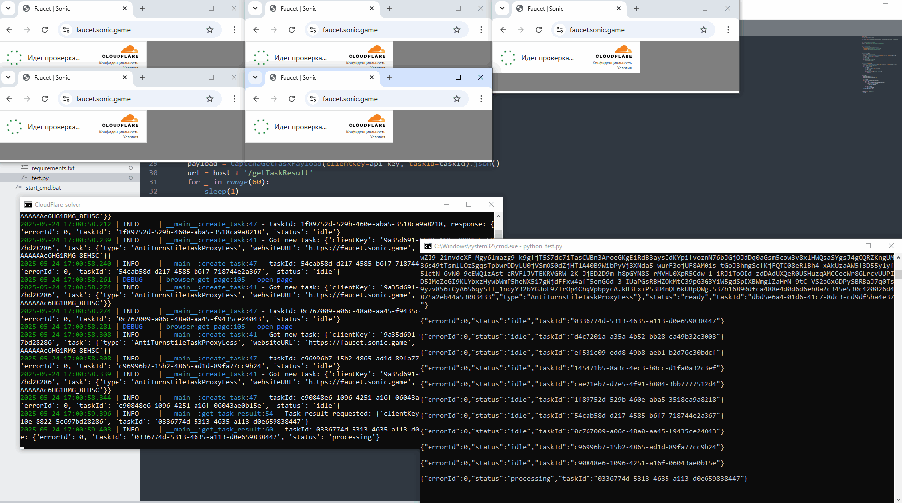

# CloudFlare Turnstile Solver

<p align="center">
  
</p>

A production-ready local server for solving CloudFlare Turnstile CAPTCHA challenges with **auto-recovery** and **health monitoring**. This enhanced version includes circuit breaker patterns, automatic system recovery, and comprehensive monitoring for maximum uptime and reliability.

## ✨ Enhanced Features

### 🚀 **Core Capabilities**

- Solves CloudFlare Turnstile CAPTCHA challenges automatically
- Returns ready-to-use tokens via REST API
- Supports multiple concurrent solving tasks with intelligent load balancing
- Docker-optimized with headless browser automation
- Cross-platform compatibility (Linux, Windows, macOS)

### 🛡️ **Production Enhancements**

- **Auto-Recovery System**: Automatically detects and recovers from failures
- **Circuit Breaker Pattern**: Prevents system overload and cascading failures
- **Health Monitoring**: Real-time system health checks and metrics
- **Resource Management**: Intelligent browser process cleanup and memory management
- **Graceful Degradation**: Smart task rejection when system is unhealthy
- **Comprehensive Logging**: Detailed logging with configurable levels

### 📊 **Monitoring & Control**

- Real-time health status endpoint
- Performance metrics and success rate tracking
- Manual system reset capabilities
- Auto-restart on consecutive failures (configurable threshold)
- Browser zombie process cleanup

## Demo

<p align="center">
  
</p>

## 📋 Requirements

- **Python >= 3.10**
- **Docker** (recommended for production)
- **Linux environment** (for optimal performance)

## 🔧 Installation

### Direct Installation

```bash
# Clone the repository
git clone https://github.com/inanitynoupcase/cloudflare-testing
cd cloudflare-testing

# Create virtual environment
python3 -m venv venv
source venv/bin/activate  # On Windows: venv\Scripts\activate

# Install dependencies
pip install -r requirements.txt

# Install browser dependencies
playwright install-deps chromium
playwright install chromium

# Configure environment
cp .env.example .env
# Edit .env with your configuration
```

## ⚙️ Configuration

Create a `.env` file in the root directory:

```env
# Must have
KIOT_PROXY_KEY= your_key
# API Configuration (Optional)
API_KEY=your_secret_api_key_here
PORT=5000
LOG_LEVEL=INFO

# Worker Configuration (Optional)
max_workers=5

# Browser Configuration (Optional)
FORCE_HEADLESS=true
SCREEN_WIDTH=1920
SCREEN_HEIGHT=1080

# Proxy Configuration (Optional)
PROXY=username:password@host:port
KIOT_PROXY_KEY=your_kiot_proxy_key
PROXY_REGION=random

# Health Monitoring (Optional)
HEALTH_CHECK_INTERVAL=30
RESTART_THRESHOLD=5
```

## 🚀 Usage

### Starting the Enhanced Server

```bash
# Standard startup
python3 api_wrapper.py --workers 5 --host 0.0.0.0 --port 5000

# With custom configuration
python3 api_wrapper.py \
  --workers 10 \
  --host 0.0.0.0 \
  --port 5000 \
  --api-key your_custom_key
```

### API Endpoints (Local)

#### 📡 **Core CAPTCHA API**

**Create Task** - `POST /createTask`

```json
{
  "clientKey": "your_api_key",
  "task": {
    "type": "AntiTurnstileTaskProxyLess",
    "websiteURL": "https://example.com",
    "websiteKey": "0x4AAAAAAAc6HG1RMG_8EHSC"
  }
}
```

**Get Result** - `POST /getTaskResult`

```json
{
  "clientKey": "your_api_key",
  "taskId": "12345678-1234-1234-1234-123456789012"
}
```

#### 🌐 **Simple External API**

**Create Task** - `GET /turnstile`

```bash
curl "http://your_vps_ip:5000/turnstile?url=https://example.com&sitekey=0x4AAA..."
```

**Get Result** - `GET /result`

```bash
curl "http://your_vps_ip:5000/result?id=task_uuid"
```

#### 📊 **Monitoring & Control**

**Health Status** - `GET /health`

```json
{
  "api_status": "online",
  "circuit_breaker_state": "CLOSED",
  "active_tasks": 3,
  "success_rate": 85.2,
  "time_since_last_success": 15,
  "available_workers": 2
}
```

**Basic Status** - `GET /status`

```json
{
  "status": "online",
  "workers": 5,
  "active_tasks": 3,
  "completed_results": 127,
  "consecutive_failures": 0
}
```

**Force Reset** - `POST /reset`

```bash
curl -X POST http://localhost:5000/reset
```

### Example Usage Scripts

#### Python Example with Enhanced Error Handling

```python
import httpx
import time
from typing import Optional

class TurnstileSolver:
    def __init__(self, base_url: str, api_key: str):
        self.base_url = base_url.rstrip('/')
        self.api_key = api_key
        self.client = httpx.Client(timeout=30.0)

    def solve_captcha(self, url: str, sitekey: str, max_wait: int = 120) -> Optional[str]:
        """Solve captcha with enhanced error handling"""

        # Check system health first
        health = self.check_health()
        if health and health.get('circuit_breaker_state') == 'OPEN':
            print("⚠️ System is in circuit breaker mode, waiting...")
            time.sleep(10)

        # Create task
        task_id = self.create_task(url, sitekey)
        if not task_id:
            return None

        # Wait for result
        return self.wait_for_result(task_id, max_wait)

    def create_task(self, url: str, sitekey: str) -> Optional[str]:
        """Create solving task"""
        try:
            response = self.client.post(f"{self.base_url}/createTask", json={
                "clientKey": self.api_key,
                "task": {
                    "type": "AntiTurnstileTaskProxyLess",
                    "websiteURL": url,
                    "websiteKey": sitekey
                }
            })

            if response.status_code == 200:
                data = response.json()
                if data.get('status') == 'idle':
                    print(f"✅ Task created: {data['taskId']}")
                    return data['taskId']

            print(f"❌ Task creation failed: {response.text}")
            return None

        except Exception as e:
            print(f"❌ Error creating task: {e}")
            return None

    def wait_for_result(self, task_id: str, max_wait: int) -> Optional[str]:
        """Wait for task completion"""
        start_time = time.time()

        while time.time() - start_time < max_wait:
            try:
                response = self.client.post(f"{self.base_url}/getTaskResult", json={
                    "clientKey": self.api_key,
                    "taskId": task_id
                })

                if response.status_code == 200:
                    data = response.json()
                    status = data.get('status')

                    if status == 'ready':
                        token = data['solution']['token']
                        elapsed = time.time() - start_time
                        print(f"🎉 Token received in {elapsed:.1f}s: {token[:50]}...")
                        return token
                    elif status == 'error':
                        print(f"❌ Task failed: {data.get('errorDescription')}")
                        return None
                    else:
                        print(f"⏳ Status: {status}")

                time.sleep(2)

            except Exception as e:
                print(f"⚠️ Error checking result: {e}")
                time.sleep(5)

        print(f"⏰ Timeout after {max_wait}s")
        return None

    def check_health(self) -> Optional[dict]:
        """Check system health"""
        try:
            response = self.client.get(f"{self.base_url}/health")
            if response.status_code == 200:
                return response.json()
        except:
            pass
        return None

# Usage example
if __name__ == '__main__':
    solver = TurnstileSolver('http://localhost:5000', 'your_api_key')

    token = solver.solve_captcha(
        url='https://example.com',
        sitekey='0x4AAAAAAAc6HG1RMG_8EHSC'
    )

    if token:
        print(f"Success! Token: {token}")
    else:
        print("Failed to solve captcha")
```

#### Bash Monitoring Script

```bash
#!/bin/bash
# monitor_turnstile.sh - Monitor and auto-restart if needed

API_URL="http://your_vps_ip:5000"
CHECK_INTERVAL=60

while true; do
    echo "🔍 Checking system health..."

    # Check health endpoint
    health=$(curl -s "$API_URL/health" | jq -r '.circuit_breaker_state // "UNKNOWN"')

    if [ "$health" = "OPEN" ]; then
        echo "⚠️ Circuit breaker is OPEN - triggering reset"
        curl -s -X POST "$API_URL/reset"
        sleep 30
    elif [ "$health" = "UNKNOWN" ]; then
        echo "❌ Health check failed - API may be down"
        # Add restart logic here if needed
    else
        echo "✅ System healthy: $health"
    fi

    sleep $CHECK_INTERVAL
done
```

## 🔍 Monitoring & Troubleshooting

### Health Monitoring

The enhanced version provides comprehensive monitoring:

```bash
# Check detailed health
curl http://your_vps_ip:5000/health | jq

# Monitor logs in real-time
tail -f logs/turnstile.log

# Check system resources
curl http://localhost:5000/status
```

### Common Issues & Solutions

| Issue                | Symptoms                       | Solution                                     |
| -------------------- | ------------------------------ | -------------------------------------------- |
| High failure rate    | Success rate < 60%             | Check `/health`, consider reset              |
| Circuit breaker OPEN | All tasks rejected             | Wait for auto-recovery or manual reset       |
| Memory issues        | Browser processes accumulating | Auto-cleanup enabled, check Docker limits    |
| Proxy issues         | Connection timeouts            | Verify proxy settings, check KiotProxy quota |

### Auto-Recovery Triggers

The system automatically recovers when:

- ✅ Circuit breaker is OPEN for too long
- ✅ No successful tasks in 10+ minutes
- ✅ Success rate drops below 20%
- ✅ Too many active tasks (potential deadlock)
- ✅ 5+ consecutive health check failures

## 📈 Performance Optimization

### Recommended Settings

| Environment | Workers | Memory | CPU      |
| ----------- | ------- | ------ | -------- |
| Development | 1-2     | 1GB    | 1 core   |
| Testing     | 3-5     | 2GB    | 2 cores  |
| Production  | 5-10    | 4GB+   | 4+ cores |
| High Load   | 10-20   | 8GB+   | 8+ cores |

### Scaling Considerations

```bash
# For high-volume usage
python3 api_wrapper.py --workers 15 --host 0.0.0.0 --port 5000

# Multiple instances with load balancer
# Instance 1: Port 5000
# Instance 2: Port 5001
# Instance 3: Port 5002
# Use nginx/haproxy for load balancing
```

## 🔐 Security Considerations

- 🔑 **API Key Protection**: Use strong, unique API keys
- 🌐 **Network Security**: Run behind reverse proxy in production
- 🔒 **Access Control**: Restrict access to trusted networks
- 📝 **Audit Logging**: Monitor API usage and access patterns
- 🛡️ **Rate Limiting**: Implement rate limiting at proxy level

## 🤝 Contributing

1. Fork the repository
2. Create a feature branch (`git checkout -b feature/amazing-feature`)
3. Commit your changes (`git commit -m 'Add amazing feature'`)
4. Push to the branch (`git push origin feature/amazing-feature`)
5. Open a Pull Request

## 📜 Changelog

### v2.1.0 (Enhanced Edition)

- ✅ Added auto-recovery system
- ✅ Implemented circuit breaker pattern
- ✅ Enhanced health monitoring
- ✅ Docker optimization
- ✅ Improved browser management
- ✅ Better error handling and logging
- ✅ Production-ready features

### v2.0.0 (Original)

- ✅ Basic Turnstile solving
- ✅ REST API
- ✅ Multi-worker support
- ✅ Playwright automation

## Support

Developed by `MrSmith06`: [telegram](https://t.me/Mr_Smith06) | [gtihub](https://github.com/MrSmith06)

API server by me: [telegram](https://t.me/inanitynoupcase) | [gtihub](https://github.com/inanitynoupcase)

If you find this project helpful, feel free to leave a tip!

- EVM address (metamask): `0x6201d7364F01772F8FbDce67A9900d505950aB99`
- EVM address (me): `0x387A7A3Fb268445dB0845ab573F64D8f31c43aC7`

## 📄 License

This project is licensed under the MIT License - see the [LICENSE](LICENSE) file for details.

---

<div align="center">

**🚀 Ready for Production • 🛡️ Auto-Recovery • 📊 Comprehensive Monitoring**

_Built with ❤️ for the automation community_

</div>
